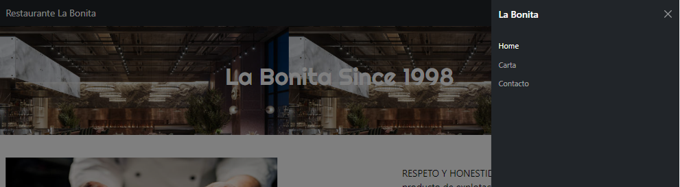
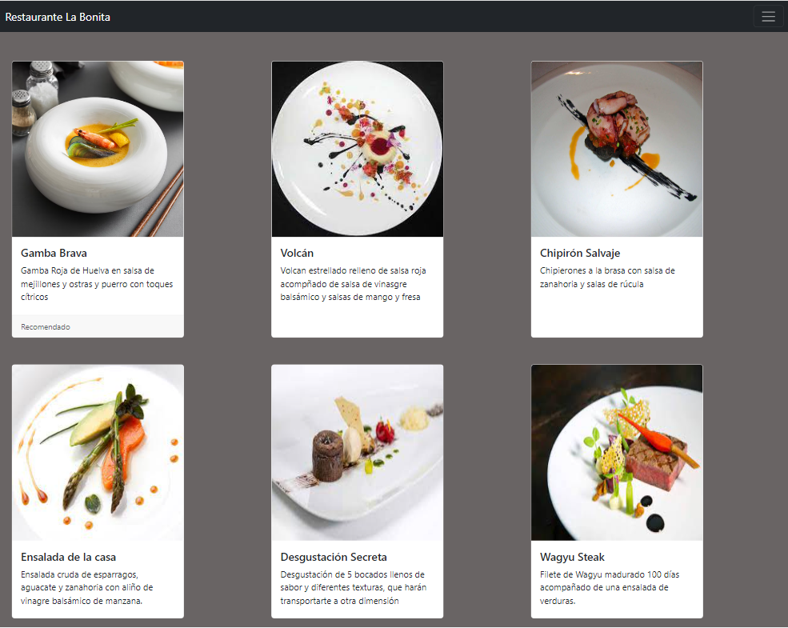
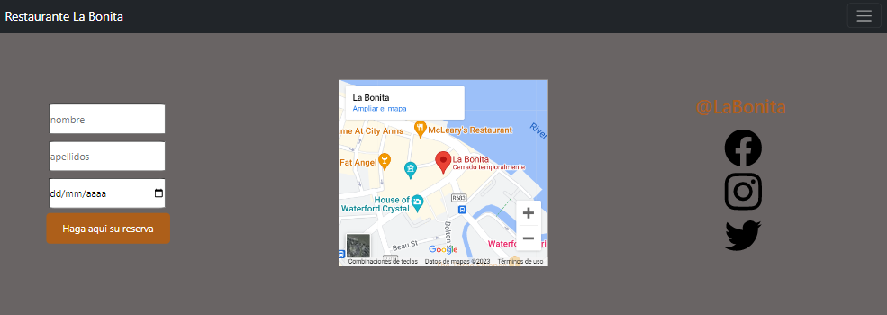

# Restaurant menu project
Project where i've made a website for a restaurant

# Functionality

Easy functionality of the website, for make  it works you just have to press the botton where you want to go.

Website link: https://carlossabrido.github.io/CartaRestaurante/

Main page here you have the nav-bar and a short descrpition about the restaurant phylosphy 

Nav-var pressing any button, it will take you to the differents web pages

Menu, as you can see here you can have a look about the differents dishes that you can get

Finally, here whe have the contact page, where you can book a table and see our location and our social media

# Technologies used

# Inquires

Any inquires you have get in touch with me through my linkedin

link: https://www.linkedin.com/in/carlos-sabrido-medina-624b77258/